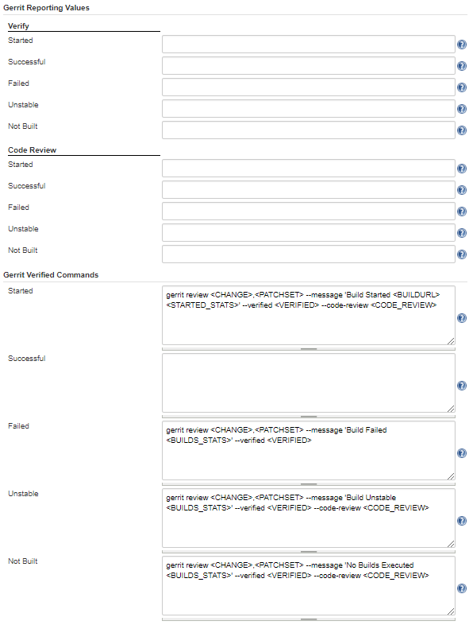
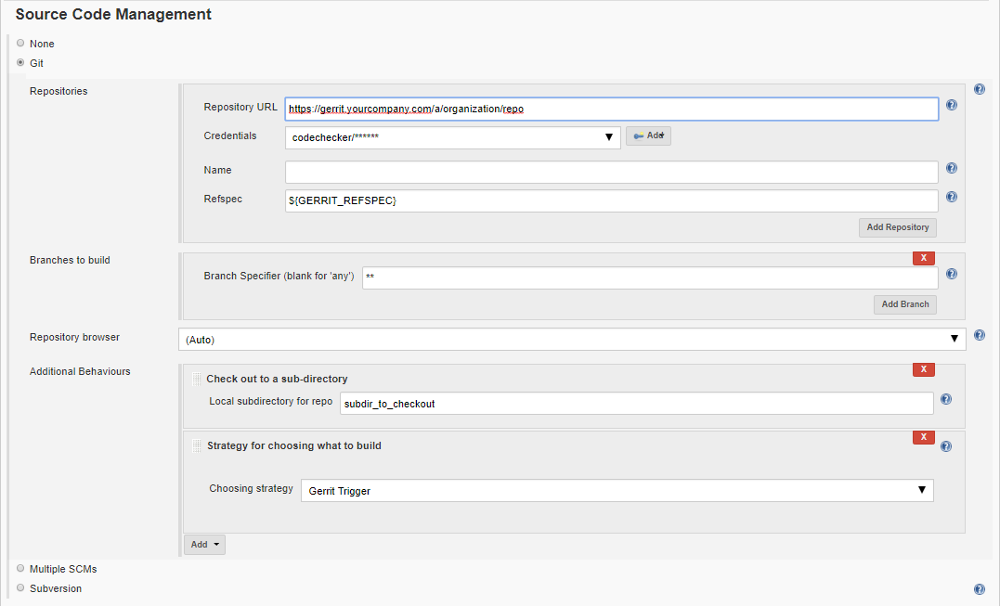
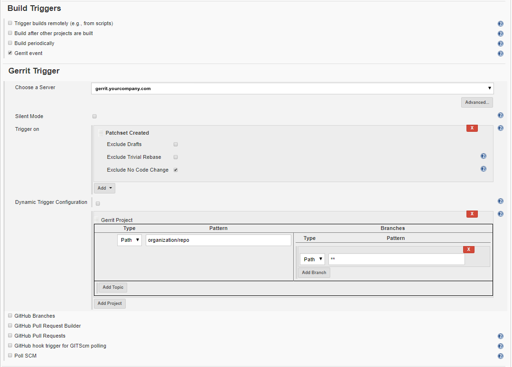
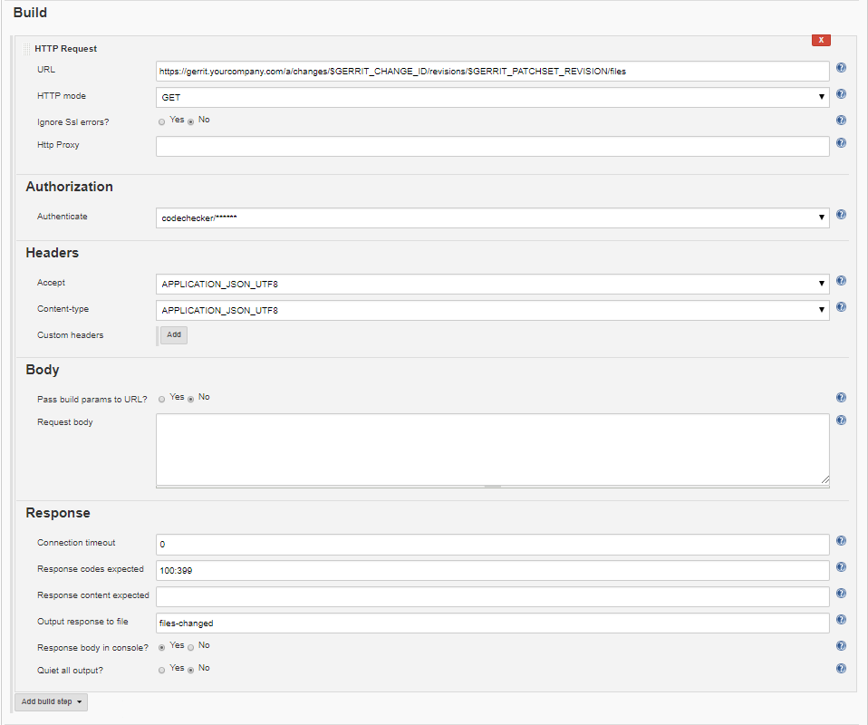
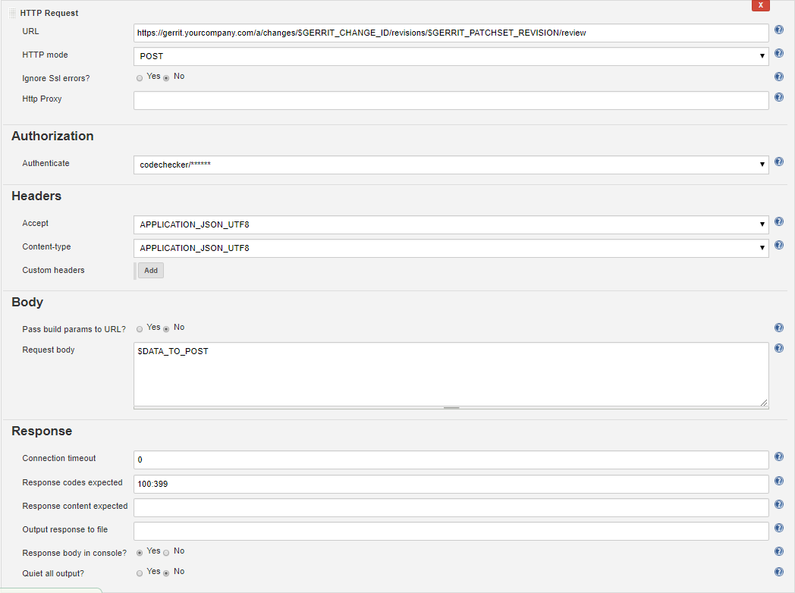

Integrate CodeChecker with Gerrit review
========================================

This guide covers a method to integrate CodeChecker with the Gerrit review
process.

To achieve this, a Jenkins job is configured to clone the changes from Gerrit,
analyze the project with CodeChecker and publish (as comments in Gerrit) the
issues found in the changed files. Based on the result of the analysis, the job
also sets the Code-Review and Verify labels in Gerrit Review. For reporting,
[Gerrit's REST API](https://gerrit-review.googlesource.com/Documentation/rest-api.html)
is used. In addition to the inline comments in Gerrit, the full result of the
analysis is stored and visualised in Jenkins.

The idea is simple:

* Create a Jenkins job that polls Gerrit for new merge requests.
* If there is a new merge request, run the CodeChecker analysis on the changed
files in Jenkins.
* If the analysis was successful (no new warnings detected), push back a
message to Gerrit with `+1` review.
* If the analysis found new warnings, push back the warnings to Gerrit as
review comments to Gerrit (the warnings will appear in Gerrit in the code as
review comments) and give a `-1` review to the change. You can also send email
notification with a link to the codechecker analysis result and the Gerrit
change to the user.

Table of Contents
=================
* [Gerrit requirements](#gerrit-requirements)
* [Jenkins requirements](#jenkins-requirements)
* [Template Scripts](#template-scripts)
* [Gerrit Trigger plugin setup](#gerrit-plugin-setup)
* [Configuring the Jenkins job](#configuring-the-jenkins-job)
    * [Source Code Managament](#jenkins-source-code-management)
    * [Gerrit Trigger](#jenkins-gerrit-trigger)
    * [Build Environment](#jenkins-build-environment)
    * [Build](#jenkins-build)
      * [HTTP Request (get the changes)](#http-request-get-the-changes)
      * [Execute shell](#execute-shell)
      * [Inject environment variable](#inject-environment-variable)
      * [HTTP Request (send the review)](#http-request-send-the-review)
    * [Results in Gerrit](#results-in-gerrit)

# Gerrit requirements 
On Gerrit, a user with the following privileges must be present:

* Read
* Label Code-Review
* Label Verified

If the user is about to clone from Gerrit through SSH, its SSH Public Key
(generated on the CI machine) has to be added to Gerrit.

# Jenkins requirements 
Required plugins

* Git plugin
* Gerrit Trigger plugin

Optional plugins for reporting (could be replaced by `curl`)

* HTTP Request Plugin
* Environment Injector Plugin

Requirements of the Jenkins machine

* CodeChecker >= 6.4
* Python >= 2.7
* Access to Gerrit (i.e. proper firewall settings)

# Template scripts 

You can find template scripts
in the [/scripts/gerrit_jenkins](/scripts/gerrit_jenkins) directory:

* [create_skipfile.py](/scripts/gerrit_jenkins/create_skipfile.py): Converts
Gerrit Review changed files `json` to CodeChecker skipfile.
* [parse_output_parser.py](/scripts/gerrit_jenkins/parse_output_parser.py):
Generates Gerrit Review json' from CodeChecker parse\'s output. 

# Gerrit Trigger plugin setup 
If Gerrit Trigger plugin is installed correctly, its settings
should be available under Manage Jenkins.
At Gerrit Connection Setting a working connection must be defined
to the Gerrit server (can be tested with Test Connection). Note that 
the SSH private key's public pair should have been already added to Gerrit.

In the Advanced settings, at Gerrit Reporting Values, the default
reporting values can be configured. These can be overwritten later in the job's
configuration. In this guide the Gerrit review message is crafted by hand,
therefore it is strongly advised to remove all the default values from the list
(otherwise once the review message is sent, the job will send another
reporting value based on this default configuration that can overwrite 
the first review and change the final result shown in Gerrit).

In the REST API section the user performing the Gerrit review must be added,
with `Enable Code-Review` and `Enable Verified` set to enabled.

Here is the config that worked best for us:

# Configuring the Jenkins job 
The job is configured as a freestyle project.

## Source Code Management 
In the job's configuration menu set `Source Code Management` to `Git`.  The
`Repository URL` is the link of the repo that has to be checked. Add new or set
from the list the credentials of the user who can clone and review the changes.
In the Repositories' advanced settings, set refspec to `${GERRIT_REFSPEC}`.
`Branch Specifier` should be set to `**`.

In the `Additional Behaviour` section, add
`Strategy for choosing what to build`, then select the `Gerrit Trigger`
from the `Choosing strategy` list.

If needed, the subdirectory used to check out the repo could be also defined
as an `Additional Behaviour`.

## Gerrit Trigger 
`Build Triggers` should be set to `Gerrit event`. This opens the Gerrit Trigger
configuration form.
In the `Choose a Server` field, the server that has been already configured in 
[Gerrit Trigger plugin setup](#gerrit-plugin-setup)
should be selected from the list.
In the server's advanced section, the `Gerrit reporting values`
(e.g. Succesful - verified +1) and `Build Messages` can be configured.
If left empty, values configured in the [plugin's setup](#gerrit-plugin-setup)
are used. One possible setting is to leave all fields empty, 
except Verify - Failed - -1. This ensures that the values reported at the 
end of the analysis (crafted manually) will not be overwritten by Jenkins.

Add a `Trigger` on `Patchset Created` and tick `Exclude No Code Change`
(there is no point in reanalyzing the project if the code has not changed).
At Gerrit Project, set the project that should trigger the build. 
Type should be Path and Pattern should be the location of your project
(relative to the Gerrit server's address).

`Branches` should be set to Type - Path and Pattern - `**`.

## Build Environment 
It is advised to delete the workspace before starting a new build.
It is also possible to delete only part of it, by applying patterns
for the files to be deleted. This is useful if the workspace contains 
dependencies which are not cloned with the project (e.g. CodeChecker binary).

## Build 
All of the followings are added as separate build steps. Note that the two HTTP
Requests and the Environment Injection could be replaced by `curl` in the
Execute Shell part. We decided to use these plugins in order to prevent
storing the reporting Gerrit user's password in the script.

### HTTP Request (get the changes) 
To query the list of the changed files from Gerrit, add a `HTTP Request` build
step.
The `URL` should be the Gerrit [revision files endpoint](https://gerrit-review.googlesource.com/Documentation/rest-api-changes.html#list-files),
filled with Jenkins' Gerrit environment variables
(`$GERRIT_CHANGE_ID` and `$GERRIT_PATCHSET_REVISION`).
In the `Advanced` section, `Authorization` should be set to the user with access
to the project. `Headers` are `APPLICATION_JSON_UTF8` for both accept
and content-type.

In the `Response` section, set `Output response` to the file
that is parsed in the following build step.

### Execute shell 
In this shell, the project is logged and analyzed by CodeChecker.
A CodeChecker skipfile is generated from the file containing the changes 
(see previous section). This is done by the `create_skipfile.py` script. 
Based on this skipfile, CodeChecker parses the analysis results. After this,
the Gerrit review message is crafted (with `parse_output_parser.py`).
Both Python scripts used here are available in CodeChecker's GitHub repository,
under `scripts/gerrit_jenkins`.

In addition, this shell can run tests. This could be used to
set Verify -1 or +1, depending on success or failure of the tests
(failing test causes the Jenkins job to fail).

It could happen that a change in a file causes an error that is found
in another file. This means, having only the inline comments in Gerrit
is not satisfactory to identify all new bugs introduced by the change.
To ensure that all issues related to the new code are found, a full analysis
has to be performed. The results of this check can be compared to a baseline
analysis and all new findings can be saved as HTML. Then the URL of
`index.html` can be sent as part of the review, shown as a normal
(non-inline) comment.

Our recommendation for having an up-to-date baseline is to
create a Jenkins job which is triggered on every merge to the master branch.
This job can perform a full analysis and store the analysis results on a
CodeChecker server. After this, `CodeChecker cmd diff` can be used to
compare the two analysis.

The following script is an example of what could be added 
to an Execute shell build step, to achieve the above.
~~~~~~{.sh}
# Make sure all requirements of the build is fulfilled by this stage!
# Log the build.
CodeChecker log -b "build command" -o compile_cmd.json

# Run the tests. If this fails, the result will be verified -1.
make tests

# Check the project.
# NOTE: It is possible to use the skipfile of changed files in the analysis,
# but it is discouraged, since changes can cause errors in other files.
CodeChecker analyze \
  -e sensitive \
  -j 16 \
  compile_cmd.json \
  -o cc_reports

# Generate skipfile of changed files from Gerrit.
python create_skipfile.py files-changed skipfile

# Diff to baseline and filter for new findings, i.e. intorudced
# by the changes. Save the output as HTML in Jenkins' userContent
# directory, so it is available on a webserver.
CodeChecker cmd diff \
  -b clangsa_checkers-merge \
  --url your_baseline_url \
  -n cc_reports \
  --new \
  -o html \
  -e $JENKINS_HOME/userContent/$JOB_NAME/$BUILD_NUMBER

# Craft the review message and write it into a file,
# that is later going to be loaded as an Environment Variable.
echo DATA_TO_POST=\\ > review
CodeChecker parse -i skipfile cc_reports |
  python parse_output_parser.py \
    $WORKSPACE/repo_dir \
    --report_url http://your_jenkins_address/userContent/$JOB_NAME/$BUILD_NUMBER/index.html \
      >> review

~~~~~~

### Inject environment variable 
To load the previously crafted review message as an environment variable,
add an Inject environment variables build step. The file path is the 
path of the file written at the end of the execute shell step, 
while the content field can remain empty.

### HTTP Request (send the review) 
To send the crafted Gerrit review, add a `HTTP Request` build step.
The `URL` should be the Gerrit
[revision set review endpoint](https://gerrit-review.googlesource.com/Documentation/rest-api-changes.html#set-review),
filled with Jenkins' Gerrit environment variables
(`$GERRIT_CHANGE_ID` and `$GERRIT_PATCHSET_REVISION`). 
The `HTTP method` to use is `POST`.
In the `Advanced` section, `Authorization` should be set to a user with access
to the project in Gerrit. `Headers` are `APPLICATION_JSON_UTF8` for both accept
and content-type.

The request's `body` should be set to the environment variable that was
injected before, which contains the review message.

## Results in Gerrit 
Expected Gerrit review results:

Detailed view of a report:

