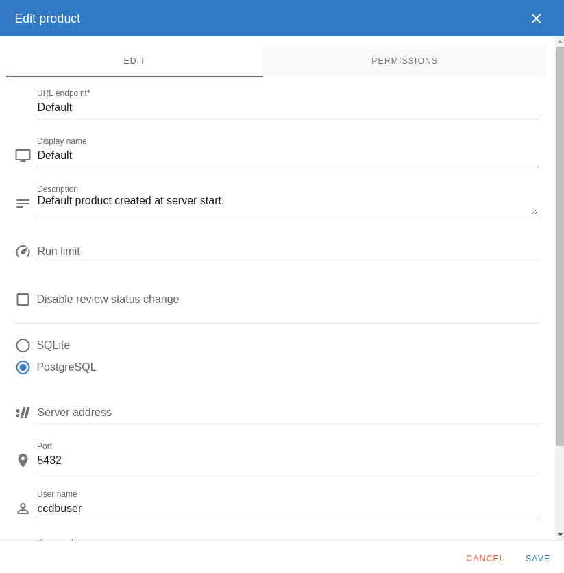
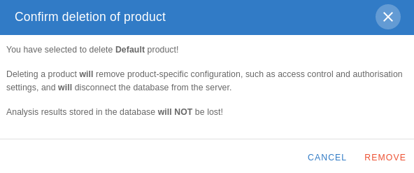
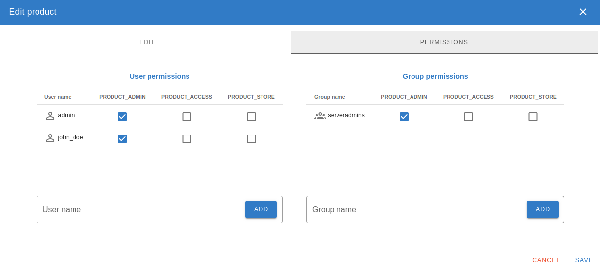
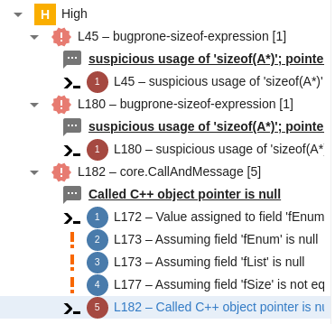
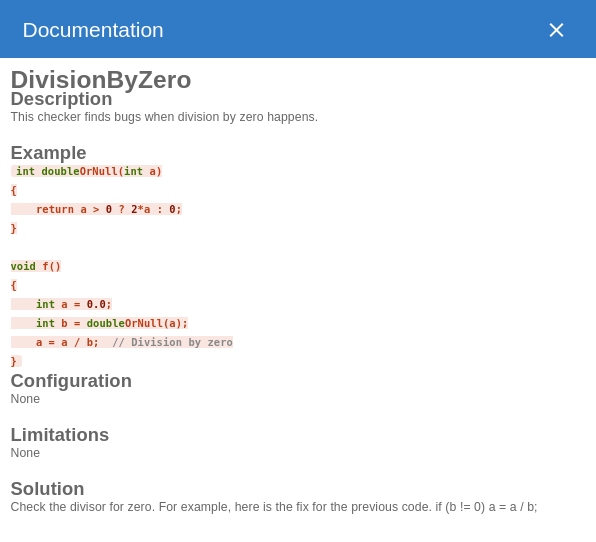
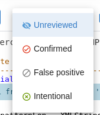
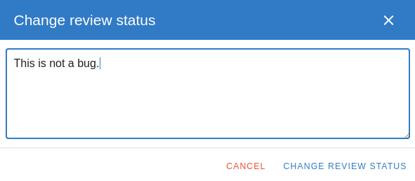
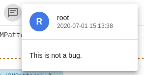
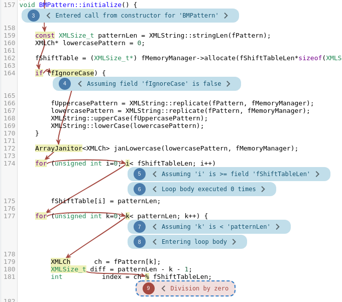
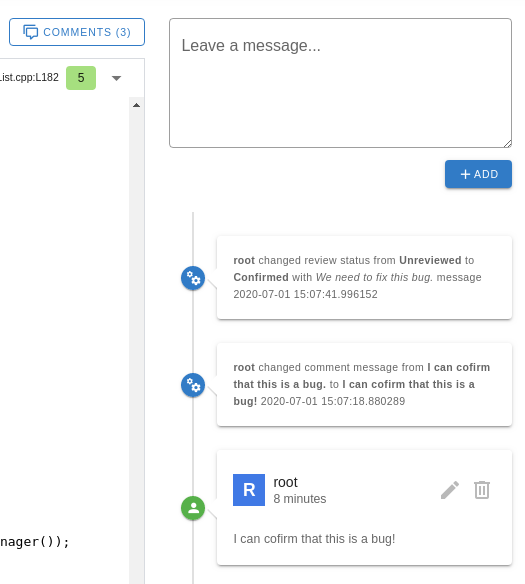

User Guide
==========

**CodeChecker** is a static analysis infrastructure built on the [LLVM/Clang
Static Analyzer](http://clang-analyzer.llvm.org) toolchain, alternative tool for
[`scan-build`](http://clang-analyzer.llvm.org/scan-build.html) in a Linux or
macOS (OS X) development environment.

More descriptions and guides available
<a href="https://github.com/Ericsson/codechecker/blob/master/README.md">
on GitHub</a>

Table of Contents
=================

* [Products](#userguide-products)
  * [Managing products](#userguide-managing-products)
    * [Disable review status change](#userguide-disable-review-status-change)
    * [Remove a product](#userguide-remove-product)
  * [Managing permissions](#userguide-managing-permissions)
* [List of runs](#userguide-list-of-runs)
  * [Filter runs](#userguide-filter-runs)
  * [Compare runs](#userguide-compare-runs)
  * [Delete runs](#userguide-delete-runs)
  * [Sorting runs](#userguide-sorting-runs)
* [Checker statistics](#userguide-checker-statistics)
  * [Filtering statistics](#userguide-filter-statistics)
  * [Uniqueing checker statistics](#userguide-checker-statistics-uniqueing)
* [Analysis results](#userguide-analysis-results)
  * [Filtering](#userguide-filtering)
    * [Remove filtered reports](#userguide-remove-filtered-reports)
    * [Clear report filters](#userguide-clear-report-filters)
    * [Unique reports](#userguide-unique-reports)
  * [Diff mode](#userguide-diff-mode)
    * [Compare two different runs](#userguide-diff-runs)
    * [Compare two different tagged versions of the same](#userguide-diff-tags)
  * [Review status](#userguide-review-status)
  * [Detection status](#userguide-detection-status)
  * [Severity levels](#userguide-severity-levels)
  * [Manage source components](#userguide-manage-source-components)
* [Bug view](#userguide-bug-view)
  * [Report navigation tree](#userguide-report-navigation-tree)
  * [Button pane](#userguide-button-pane)
     * [Show documentation](#userguide-show-documentation)
     * [Change review status](#userguide-change-review-status)
  * [Same reports](#userguide-same-reports)
  * [Bug path view](#userguide-bug-path-view)
  * [Comment](#userguide-comment)
* [Run history](#userguide-run-history)
* [Server configuration](#userguide-server-config)
  * [Notification banner](#userguide-notification)

#  Products
The product system allows a single CodeChecker server to serve multiple separate
result databases, named "products", under the same IP address and authentication
domain.

##  Managing products

After enabling the administrative actions by clicking on the
*Show administration* button in the top right corner, click *Add new product*,
then fill the form presented. The values that need to be filled here are the
same as the arguments for `CodeChecker cmd products add`.
These buttons are visible only for *Super Users*.

If the product creation is successful, the window will disappear and the
product will appear in the product list.

Editing a product is done through the pencil icon, which is visible when
administrative actions are enabled. This window lets you edit the product's
configuration.

###  Disable review status change
Review status change can be disabled on the WEB UI to force programmers to use
inline source code comments. This can be configured on the product editing
window by administrators of a product.

###  Remove a product
Products can be deleted by clicking on the red trash bin. This way the product
is only unmounted from the server (losing access control data and connection),
but **no analysis results are deleted**.

##  Managing permissions
* Server-wide permissions can be edited by clicking *Edit global permissions*.
* Product-level permissions can be edited by clicking the edit icon for the
product you want to configure the permissions.

From the dropdown, select the permission you want to configure. The two lists
show the users and groups known to the system - if a tick is present in its row,
the given user or group has the permission directly granted. (Users who only
have a certain permission through permission inheritance are not shown with a
tick.)

Only the permissions you have rights to manage are shown in the dropdown.

You can edit multiple permissions opening the window only once. Simply tick or
untick the users/groups you want to give the permission to or revoke from them.
Clicking *OK* will save the changes to the database.

#  List of runs
List page contains the analysis runs available on the server under the selected
product.

You can do the following on this page:
- [Filter runs](#userguide-filtering).
- [Compare analysis](#userguide-compare-runs).
- [Delete runs](#userguide-delete-runs).
- [Sorting runs](#userguide-sorting-runs).

The meaning of the table columns:
- **Diff** - In this column you can select two runs (*baseline* and *newcheck*)
which will be compared to each other by click on the *Diff* button.
- **Name** - Name of the run.
- **Number of unresolved reports** - Number of non unique reports excluding
*Resolved*, *False positive* and *Intentional* reports.
- **Storage date** - Storage date of the runs.
- **Analysis duration** - Duration of the analysis.
- **Check command** - By clicking on *Show* text the check command will be shown
in a pop-up window.
- **Detection status** - Detection statuses are calculated based on the detection
status values from the previous store where the reports are stored again with
the same run name. When storing the results of a run from scratch then each
report will have detection status of *New*.
- **Version tag** - Latest version tag of the run.
- **Delete** - In this column you can select multiple runs which will be removed
by clicking on the *Delete* button.

##  Filter runs
You can filter runs by run name using the input box above the run list table.
The filter is **case insensitive** and doing a **substring matching**. If we
start typing some phrase in this input box, the list are being _filtered
automatically_. 

##  Compare runs
Calculates difference between two analyses of the project, showing which bugs
have been fixed and which are newly introduced.

##  Delete runs
You can delete multiple runs by selecting them and clicking on the Delete
button. It will remove the run and all related data from the database.

##  Sorting runs
It is possible to change the order of the runs by clicking on a cell at header
of the run list table. For example, you can sort the run list by the number of
bugs or the run name.

#  Checker statistics
A statistical overview can be seen under "Checker statistics" panel.
Here you can see multiple tables: 
- **Checker statistics** table shows the number of reports by checkers based on
some attributes of the report like severity, and report status.
- **Severity statistics** table shows the number of report by severity levels.

##  Filtering statistics
We can get statistics only for specified runs, files, checker names etc. by
using the filter bar beside the statistic tables. For more information check
the report filtering [section](#userguide-filtering).

##  Uniqueing checker statistics
The same bug may appear several times if it is found on different execution
paths, i.e. through different function calls. By checking **Unique reports** a
report appears only once even if it is found on several paths. By default
uniqueing is enabled for statistics.

#  Analysis results
If you select a run at the [list of runs](#userguide-list-of-runs) view, you get
to this page. This page lists the analysis result for the given run.

##  Filtering
When opening the bug list view under "All reports" tab or by clicking a specific
run or by opening "diff view" between two runs then the following filter options
are available:
- [**Unique reports**](#userguide-unique-reports) - You can uniqueing the
reports by checking this.
- **Report hash** - Every report has a unique (hash) identifier called Report
Identifier (RI) which can be filtered by using this input box.
- **Baseline**
  - **Run name** - You can select one or more run names. The result list is
restricted on the findings in these runs. By selecting a specific run in the
"runs" view this field is filled by default. In "All reports" tab no run is
selected in which case the reports from all runs are visible.
  - **Run tag** - When runs are stored in update mode (i.e. on the same run
name), then the specific runs can be tagged in order to be easier to identify
them. By this field you can select the reports found during a specific run
event.
- [**Newcheck**](#userguide-diff-mode)
  - **Run name** - Here you can select multiple run name which you want to
compare against the baseline filter set.
  - **Run tag** - Here you can select multiple run tags which you want to
compare against the baseline filter set.
  - **Diff type** - Here you can set if you'd like to see the bugs which appear
only in the **Baseline**, **Newcheck** or both.
- [**Review status**](#userguide-review-status) - You can select the reports
with the given review status to check only *False positive*, *Unreviewed*, etc.
reports.
- [**Detection status**](#userguide-detection-status) - You can select the
reports with the given detection status to check only *Unresolved*, *Resolved*,
etc. reports.
- [**Severity**](#userguide-severity-levels) - The nature of the bugs is sorted
in different severity levels. For example, a division by zero or a null pointer
dereference is more serious than an unused variable. By this field you can
select the reports on the given severity levels.
- **Bug path length** - A bug path length interval can restrict the list of
displayed bug reports. In these fields you can choose the minimum and maximum
values of bug path length.
- **Detection date** - A date interval can also restrict the list of displayed
bug reports. In this field you can choose the date of detection or fixing.
- **File path**: You can choose a set of files to restrict the list of bug
reports.
- [**Source component**](https://github.com/Ericsson/codechecker/blob/master/docs/web/user_guide.md#source-components) -
Here you can select multiple source components which are named collection of
directories specified as directory filter.
- **Checker name** - If you are interested in specific type of bugs then here
you can choose them.
- **Checker message** - The static analysis tools provide a message to indicate
the reason of a specific bug. This message is also filterable.

Run name may contain `*` quantifiers which matches any number of characters
(zero or more). So if you have `run_1_a_name`, `run_2_b_name`, `run_2_c_name`,
`run_3_d_name` then `run_2*` will select `run_2_b_name` and `run_2_c_name`.

When you select a filter option on any field then a number indicates on the
right side of the option the number of reports which belong to that specific
option. If the report count could not be determined this value will be *N/A*.

### Remove filtered reports
Filtered reports can be removed by clicking on the **Remove filtered reports**
button at the top of the filter bar.

**!!!WARNING!!!** Once you have removed filtered reports it can not be undone.
Please make sure that you want to remove all filtered results before clicking
on this button.

### Clear report filters
Filter options can be cleared separately by clicking on the trash icon beside
a filter or all filters can be cleared by using *Clear All Filters* button at
the top of the filter bar.

###  Unique reports
At the top of the filter panel there is a "Unique reports" checkbox. This
narrows the report list to unique bug. The same bug may appear several times if
it is found on different control paths, i.e. through different function calls or
in multiple runs. By checking "Unique reports" a report appears only once even
if it is found on several paths.

##  Diff mode
In diff mode you can calculate the difference between multiple analyses of the
project, showing which bugs have been fixed and which are newly introduced or
which can be fined in all runs.

At the **Baseline** filter section you can select the run names and run tags
against which you want to check the difference.

At the **Newcheck** filter section you can select the run names and run tags
which you want to compare against the *Baseline* runs and run tags.

###  Compare two different runs

###  Compare two different tagged versions of the same

##  Review status
Reports can be assigned a review status of the following values:
-  **Unreviewed**
(_default_): Nobody has seen this report.
-  **Confirmed**:
This is really a bug.
- 
**False positive**: This is not a bug. Before marking a bug false positive
you should read the [false positive how to](https://github.com/Ericsson/codechecker/blob/master/docs/analyzer/false_positives.md).
-  **Intentional**:
This report is a bug but we don't want to fix it.

For more information [see](#userguide-change-review-status).

##  Detection status
The detection status is the state of a bug report in a run. When
storing the results of a run from scratch then each report has
detection status  **New**.
When the reports stored again with the same run name then the detection status
can change to one of the following options:
-  **Resolved**: when
the bug report can't be found after the subsequent storage.
-  **Unresolved**:
when the bug report is still among the results after the subsequent storage.
-  **Reopened**: when
a resolved bug appears again.
-  **Off**: were reported
by a checker that is switched off during the analysis.
-  **Unavailable**:
were reported by a checker that does not exists anymore because it was removed
or renamed.

##  Severity levels
We are mapping checker names to different severity levels:
-  **Unspecified**
-  **Style**:
(E.g. _modernize-raw-string-literal, modernize-use-auto, etc._)
-  **Low**
(E.g. _deadcode.DeadStores, misc-unused-parameters, etc._)
-  **Medium**:
(E.g. _unix.Malloc, core.uninitialized.Assign, etc._)
-  **High**:
(E.g. _core.DivideZero, core.NullDereference, cplusplus.NewDelete, etc._)
-  **Critical**

##  Manage source components
Source components are named collections of directory filters. Source components
can be managed only by administrators after clicking on the pencil icon at the
Source component filter.

A pop-up window will be opened where you can add, edit or remove existing
source components.

#  Bug view
At this page you can navigate between reports and check the errors what
CodeChecker found.

This page has four main parts:
- [Report navigation tree](#userguide-report-navigation-tree)
- [Button pane](#userguide-button-pane)
- [Bug path view](#userguide-bug-path-view)
- [Comments](#userguide-comment)

##  Report navigation tree
Report Navigation Tree shows the found reports at the currently opened file. The
reports are grouped by the severity level.
You can navigate between them by clicking on a node in the tree.

##  Button pane
Button Pane contains several items which help you to change or get some
property of the currently opened report. 

###  Show documentation
Show Documentation button shows the documentation of the actual checker which
identified by the currently opened report.

###  Change review status
Reports can be assigned a review status of *Unreviewed*, *Confirmed*, *False
positive*, *Intentional*, along with an optional comment on why this status was
applied. We can change the review status from the default
 _Unreviewed_ option
to something else in the report details view above the file view.

If you changed the review status, you can optionally explain the reason why
you changed it.

If somebody has already changed the review status from the default one, you can
see extra information (who changed the review status, when and why) beside
the review status selector by hovering on the message icon. This message icon is
hidden by default if nobody has changed the review status.

##  Same reports
Several reports may belong to a specific bug if the but itself can be reached on
different control paths. In the Bug viewer you can check whether the selected
bug is available on a different path.

##  Bug path view
Some checkers are able to follow the execution path along the control flow of
the program. If a bug appears on any of these paths, then CodeChecker is able to
present the full path on which this so called symbolic execution reached the
place of error. This path can be checked in this bug path view.

##  Comment
Bug reports can be commented. You can add new comments,
edit () and
delete () them.

The author of the comment will be the currently logged in user. If the user is
not logged in, the author of the comment will be _Anonymous_.

Comments are shown for the same report found in multiple runs.

#  Run history
When selecting a run then a "Run history" tab appears next to the
*Bug overview*. In this window you can check the specific run events which
happened during a storage process under the same run name. This way you can list
the reports' state in the selected run event.

#  Server Configuration
##  Global Notification banner
There is an option to set a global notification text, that will show on top of every page over the CodeChecker logo. For every connecting client. 

You can edit this alert on the products page, after enabling administration buttons, with "Edit announcement" button, but **Super User** permissions are necessary.

You can remove the current notification by saving an empty text.

